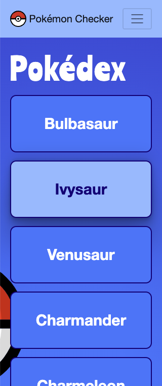
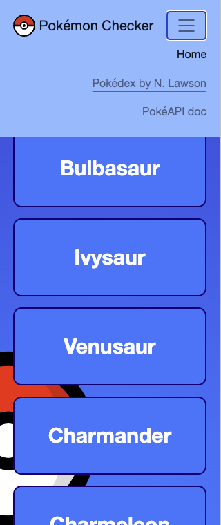
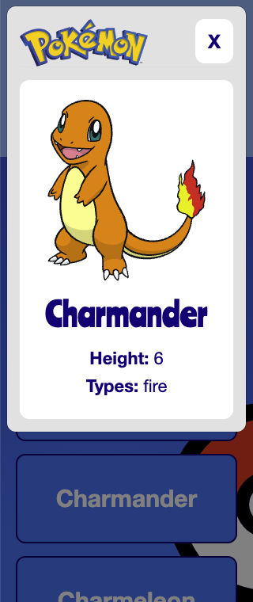
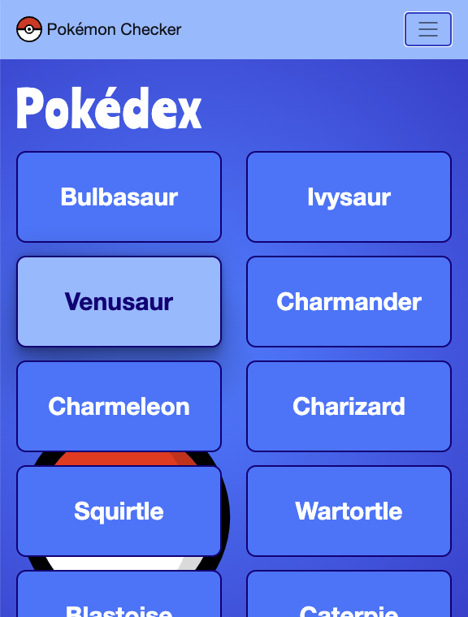
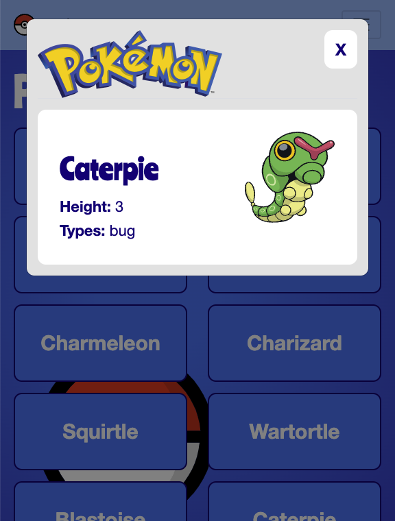
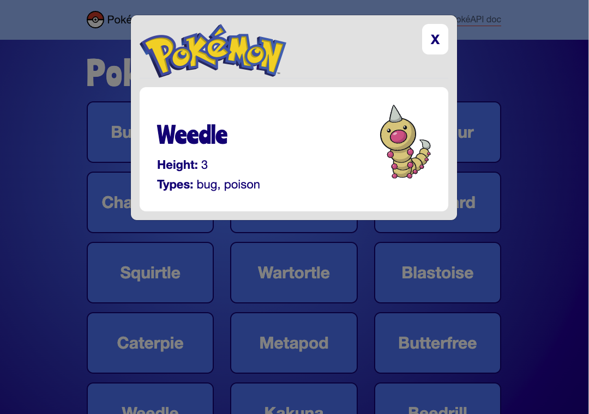

# Pokédex - Pokémon Checker

### What is this about?

This Pokédex - Pokémon Checker App was build as a task for Achievement 1 in [Career Foundry's Full-Stack Web Development Program](https://careerfoundry.com/en/courses/become-a-web-developer/).  
It is a responsive web application that fetches data from the [PokéAPI](https://pokeapi.co/).  
Pokémon names are displayed as a list.  
Pokémon details are displayed via Modal.

[Click here to jump to the bottom to see screenshots](#Screenshots)

### Requirements

- mobile first (starting at 320px), responsive
- HTML, CSS and JavaScript from scratch
- Bootstrap (CSS, JS)
- include Bootstrap's Navbar Component
- fetch Pokémon names and Pokémon detailed URLs of a list of Pokémons
- fetch Pokémon Details via detailed URL
- create and style a Home Page that displays fetched Pokémon names as a list `li` within a static `ul`
  - do not display all 1279 available Pokémon names, but limit that request
  - in that list, dynamically create mandatory `li` and `button` elements for each item
  - click on `button` needs to open a Modal
- create and style a Modal, that displays fetched Pokémon Details
  - for this, use Bootstrap's Modal Component
  - Pokémon Details mandatory to display are: image, name, height, types
  - all needed HTML elements must be created dynamically
- use Polyfills for fetch and promises (browser support)
- properly fromat and lint all files (Prettier, ESLint)
- properly postCSS, autoprefix and minify all files (manually, no build workflow)

### Languages, Libraries, Frameworks

- HTML
- CSS
- JavaScript
- Bootstrap (CSS and JS; jQuery)
- Polyfill for promises
- Polyfill for fetch

### Sources

- [PokéAPI documentation](https://pokeapi.co/docs/v2)
- [PokéAPI Pokémon list, with name and Url to detailed Pokémon information](https://pokeapi.co/api/v2/pokemon/?limit=150)
- [PokéAPI example of a detailed Pokémon](https://pokeapi.co/api/v2/pokemon/1/)
- [Polyfill for promises](https://github.com/taylorhakes/promise-polyfill) with this [min.js](https://raw.githubusercontent.com/taylorhakes/promise-polyfill/master/dist/polyfill.min.js)
- [Polyfill for fetch](https://github.com/github/fetch) with this [js file](https://github.com/github/fetch/releases/download/v3.0.0/fetch.umd.js)
- [Bootstrap 4.3.1 via CDN](https://getbootstrap.com/docs/4.3/getting-started/introduction/#js)
- [jQuery min to replace jQuery slim](https://releases.jquery.com/)

### Tools, Extensions

- Visual Studio Code
- GitHub / [Pokémon Checker on GitHub Pages](https://ellypirelly.github.io/simple-pokedex-app/)
- [Visual Studio Extension "Live Server"](https://marketplace.visualstudio.com/items?itemName=ritwickdey.LiveServer)
- [Visual Studio Extension "Prettier - Code formatter"](https://marketplace.visualstudio.com/items?itemName=esbenp.prettier-vscode)
- [Visual Studio Extension "ESLint"](https://marketplace.visualstudio.com/items?itemName=dbaeumer.vscode-eslint)
- [PostCSS CSS variables playground](https://madlittlemods.github.io/postcss-css-variables/playground/)
- [Autoprefixer](http://autoprefixer.github.io/)
- [Minify CSS](https://www.toptal.com/developers/cssminifier)
- [Minify JS](https://www.toptal.com/developers/javascript-minifier)

### How to run this?

At time of writing, there's no npm packages or a build workflow present

- clone the repo
- `cd` into project
- if on Visual Studio Code, install "Live Server" extension, go to bottom menu and click "Go Live":  
    
- this is going to open the Pokémon Checker on localhost http://127.0.0.1:5500/

### Screenshots

#### 320px

  

#### 567px

  

#### max-width for content

