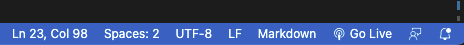

# Pokémon Checker

### What is this about?
This Pokémon Checker App will be build as Achievement 1 in [Career Foundry's Full-Stack Web Development Program](https://careerfoundry.com/en/courses/become-a-web-developer/).  
It is a responsive web application, build with HTML, CSS and JavaScript, that fetches data from the [PokéAPI](https://pokeapi.co/).  
See additional sources here:
- [PokéAPI documentation](https://pokeapi.co/docs/v2)
- [PokéAPI Pokémon list, with name and Url to detailed Pokémon](https://pokeapi.co/api/v2/pokemon/?limit=150)
- [PokéAPI example of a detailed Pokémon](https://pokeapi.co/api/v2/pokemon/1/)

HTML to display the fetched Pokémons will be generated dynamically, depending on amount of items fetched.  
While clicking on one of the displayed Pokémons, a modal will open with additional information to that Pokémon.

### Tools / Requirements
- Visual Studio Code
- GitHub / GitHub Pages
- HTML, CSS, JavaScript
- for the sake of this exercise: Polyfills
  - [Polyfill for promises](https://github.com/taylorhakes/promise-polyfill) with this [min.js](https://raw.githubusercontent.com/taylorhakes/promise-polyfill/master/dist/polyfill.min.js)
  - [Polyfill for fetch](https://github.com/github/fetch) with this [js file](https://github.com/github/fetch/releases/download/v3.0.0/fetch.umd.js)

### How to run this?
At time of writing, there's no npm packages or a build workflow present
- clone the repo
- `cd` into project
- if on Visual Studio Code, install "Live Server" extension, go to bottom menu and click "Go Live":  
  
- this is going to open the website on localhost http://127.0.0.1:5500/
